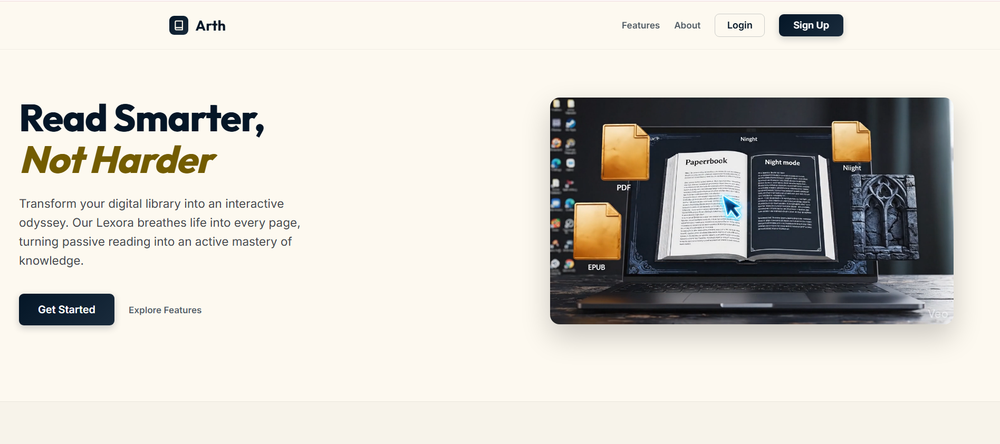
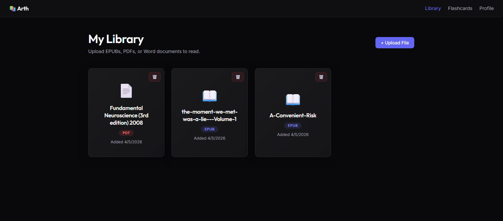
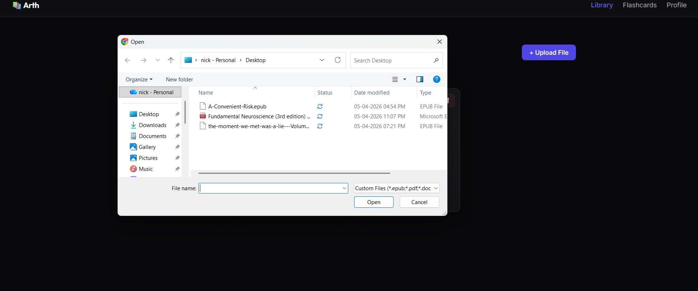
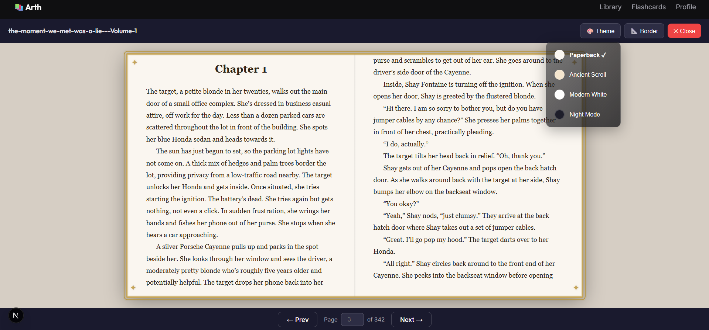
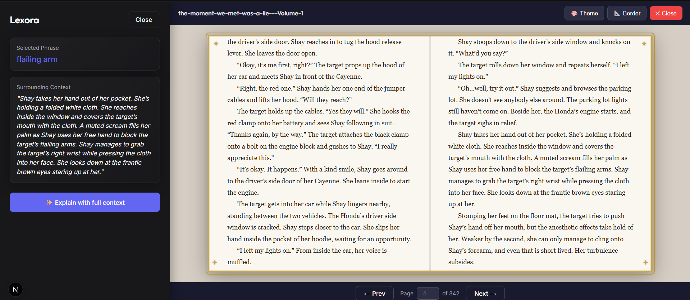
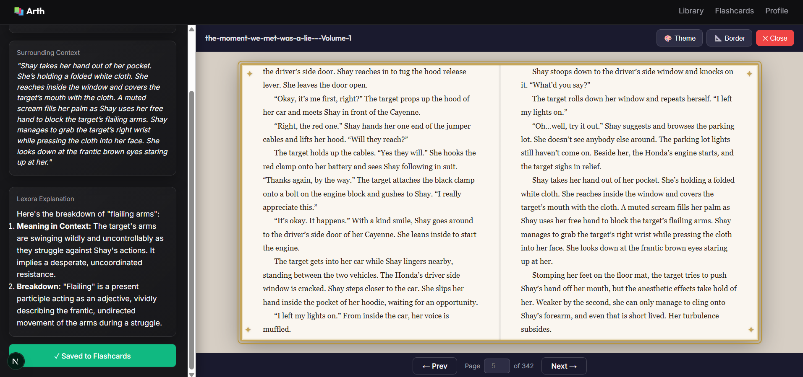
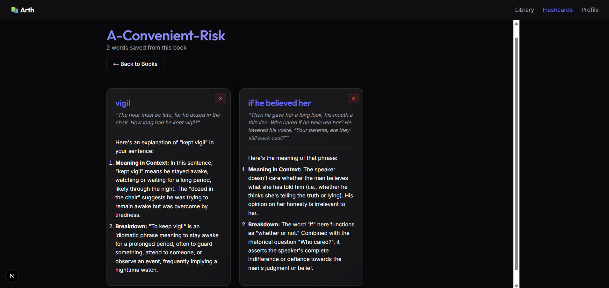

# Arth: The Premium Digital Sanctuary

Arth is a modern, full-stack Next.js web application designed to bridge the gap between elegant physical reading and advanced digital tooling. It takes raw document formats (EPUB, PDF, DOCX) and renders them in high-fidelity formats featuring custom typography and dynamic borders, actively assisted by our proprietary AI context companion, **Lexora**.

## Platform Highlights

1. **Universal Format Uplifting**: Seamlessly processes and standardizes EPUBs, PDFs, and DOCX files.
2. **Lexora AI Companion**: Non-intrusive, academically-backed contextual insights natively overlaying the reading interface to drastically lower cognitive load.
3. **Lexora Synthesis Engine**: Dynamic flashcard generation system allowing users to extract and review critical lexicon.
4. **Authentic Reading UX**: Curated CSS/canvas typography structures, dynamic borders (Classic, Gothic, Royal), and themes (Night, Paperback, Ancient).
5. **Secure Authentication**: Protected routes powered by a robust Supabase integration.

## Visual Tour

  
  
<i>The engaging landing page introducing readers to Arth and Lexora.</i>

  
  
  
<i>The central dashboard managing EPUBs, PDFs, and DOCX documents simultaneously.</i>

  
  
  
<i>Native OS file-picker integration for rapid multi-format ingestion.</i>

  
  
<i>The core reading UI featuring 'Ancient Scroll' modes and custom gold borders.</i>

  
  
<i>Lexora dynamically overlaying contextual explanations of selected text without breaking your reading flow.</i>

  
  
<i>Directly saving Lexora insights into the master Flashcard system for future review.</i>

  
  
<i>The Lexora Synthesis Engine generating comprehensive breakdowns from selected textbook jargon.</i>

## Project Structure

- `/src/app/` - Next.js App Router endpoints, including the custom `/dashboard`, `/auth`, and dynamically routed `/read/[bookId]` spaces.
- `/src/app/api/` - Backend secure endpoints, specifically the Lexora AI communication pipeline (`/api/summary/route.js`).
- `/src/components/` - Critical presentation logic including format-specific parsing components (`PdfReader`, `DocxReader`, `EpubReader`).
- `/docs/` - Extensive developer guides and technical architectural breakdowns.

## Getting Started

Please refer to the [Developer Guide](./docs/DEVELOPER_GUIDE.md) for detailed deployment, API key configuration, and local running instructions.

---
_Designed and developed for the modern scholar._
